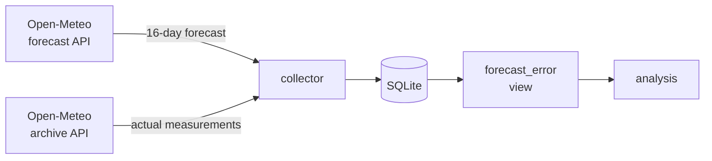

# Weather Accuracy

**How wrong are weather forecasts and do they get worse the further ahead they look?**

Every morning this project saves what the forecast says will happen. Later it saves what actually happened, and compares the two.

The useful part is that each forecast is stored together with the date it was issued. A single day ends up covered by up to 16 forecasts, made anywhere from 15 days out to the morning of. So I can ask things like:

- Is a 10-day forecast twice as bad as a 2-day one, or ten times?
- Does the model lean towards predicting warmer weather than we get?
- Is Zakopane really harder to forecast than Rzeszów?

I picked the four locations to be as different from each other as I could:

| Location | Terrain     | Why                                                              |
| -------- | ----------- | ---------------------------------------------------------------- |
| Rzeszów  | lowland     | my baseline, and where I live                                    |
| Zakopane | mountains   | valleys trap cold air and terrain wrecks models                  |
| Sopot    | coast       | the sea flattens temperature swings, breezes ruin wind forecasts |
| Suwałki  | continental | Poland's cold pole, biggest temperature extremes                 |

## Status

| Component                                  | State                         |
| ------------------------------------------ | ----------------------------- |
| Data collection (forecasts + observations) | ☑ running daily               |
| Database schema + migrations               | ☑                             |
| Accuracy analysis (`forecast_error` view)  | ☑                             |
| REST API                                   | planned                       |
| Web dashboard                              | planned                       |
| Deployment (VPS)                           | planned, runs locally for now |

Collection started on `11-08-2026`. Pairs of forecast and outcome can only be built going forward, so it takes about two weeks before the averages mean anything.

## How it works



Once a day, for every location, the collector:

1. grabs a 16-day forecast and saves each day of it, tagged with today's date as `fetched_at`
2. grabs the actual measurements for the past week from the archive API

Do that for a while and one calendar day accumulates a stack of forecasts made at different distances in the past. Join those against what was measured and you get the error at each lead time.

### Why I can't backfill forecasts

Observations are easy to recover. The archive API will hand me any historical date I ask for.

Forecasts are a different story. No public API will tell me what the 10-day forecast said on some past Tuesday. If I miss a day of collection, that day's long-range forecasts are gone for good. Most of the design decisions below come back to this.

## Data model

```
location ──┬── forecast     (location_id, target_date, fetched_at, metrics…)
           └── observation  (location_id, measured_at, metrics…)
```

**`forecast`** holds what was predicted. It's unique on `(location_id, target_date, fetched_at)`, so the same day gets forecast over and over as it approaches.

**`observation`** holds what actually happened. Unique on `(location_id, measured_at)`, because a day only gets measured once no matter when I fetch it.

Both track max/min temperature, precipitation and wind gusts.

### The `forecast_error` view

The analysis lives in a SQL view that joins the two tables and works out the error for each metric:

```sql
CREATE VIEW forecast_error AS
SELECT
    f.location_id,
    f.target_date,
    f.fetched_at,
    CAST(julianday(f.target_date) - julianday(f.fetched_at) AS INTEGER) AS lead_time,
	ROUND(f.temp_max - o.temp_max,  2) AS temp_max_error,
	ROUND(f.temp_min -  o.temp_min,  2) AS temp_min_error,
	ROUND(f.wind_gusts - o.wind_gusts, 2) AS wind_gusts_error,
	ROUND(f.precipitation - o.precipitation, 2) AS precipitation_error
FROM forecast f
JOIN observation o
    ON  o.location_id = f.location_id
    AND o.measured_at = f.target_date
```

Two things I decided on early:

Errors keep their sign (`forecast - observation`, so positive means the forecast ran hot). And the view stays at one row per comparison instead of pre-computing averages. From signed rows I can still get bias with `AVG`, mean absolute error with `AVG(ABS(…))`, or RMSE. Going the other way is impossible, and averages are a question you ask the data, not something to bake into it.

That keeps the actual queries short:

```sql
SELECT lead_time,
       ROUND(AVG(temp_max_error), 2)      AS bias,
       ROUND(AVG(ABS(temp_max_error)), 2) AS mae,
       COUNT(temp_max_error)              AS samples
FROM forecast_error
GROUP BY lead_time;
```

## Tech stack

**Backend:** Python 3.14, [uv](https://docs.astral.sh/uv/), SQLModel + SQLAlchemy, Alembic, httpx, pydantic-settings, FastAPI (planned)

**Tooling:** ruff, mypy (strict), pytest, poethepoet

**Data:** [Open-Meteo](https://open-meteo.com/), free and no API key needed

SQLite is doing about 80 rows a day with one writer and mostly reads. Running a database server here would be all overhead and no benefit.

## Getting started

```bash
cd apps/api
uv sync
cp .env.example .env      # then set DATABASE_URL
uv run poe migrate        # create schema
uv run poe collector      # fetch today's data
```

`DATABASE_URL` deliberately has no fallback value. If it's missing the app dies on startup, which beats quietly creating an empty database in whatever directory the process happened to start in. I learned that one the hard way.

### Commands

| Command         | Description                                           |
| --------------- | ----------------------------------------------------- |
| `poe collector` | fetch forecasts + recent observations (the daily job) |
| `poe backfill`  | fetch 60 days of historical observations              |
| `poe migrate`   | apply pending migrations                              |
| `poe migration` | autogenerate a migration from model changes           |
| `poe check`     | lint + typecheck + tests                              |

### Scheduling

A `launchd` agent runs the collector every day at 06:00. I went with `launchd` over `cron` because it catches up on jobs it missed while the machine was asleep. On a laptop that gets closed every evening, `cron` would just skip the run and I'd lose the day.

The agent lives in [`deploy/launchd/`](deploy/launchd/weather-accuracy.collector.plist.example). Fill in the two placeholders, then:

```bash
cp deploy/launchd/weather-accuracy.collector.plist.example \
   ~/Library/LaunchAgents/weather-accuracy.collector.plist
mkdir -p ~/Library/Logs/weather-accuracy
launchctl bootstrap gui/$(id -u) ~/Library/LaunchAgents/weather-accuracy.collector.plist
```

`launchctl list | grep weather-accuracy` shows the last exit code in the second column, which is why the collector bothers to exit non-zero when a location fails.

## Engineering notes

**Idempotency.** Both collection paths can run as many times as you like without duplicating anything. Existing rows get detected per location before any insert, so re-running by hand or retrying after a crash is always safe.

**Failure isolation.** If the network dies while fetching one location, that error gets caught and logged, the transaction rolls back, and the other locations still get collected. The process exits non-zero if anything failed, so the scheduler's exit status actually tells me something.

**Migrations instead of `create_all()`.** `create_all()` only creates tables that don't exist yet. It won't touch one that's already there, which makes it useless the moment you need to change a column. Since the forecasts I've collected can't be re-fetched, schema changes have to keep the data. Alembic runs in batch mode here because SQLite can't `ALTER` most column properties in place.

**Partial data still counts.** A forecast day only gets thrown away if every single metric is missing. Aggregates skip `NULL`s anyway, so three good values out of four are worth keeping.

## Roadmap

- [ ] FastAPI endpoints over `forecast_error`, with frontend types generated from the OpenAPI schema
- [ ] Web dashboard showing error against lead time, per location and metric
- [ ] Deploy to a VPS (nginx + systemd timer)
- [ ] Tests
- [ ] Treat precipitation as hit/miss instead of averaging millimetres, since most days are dry and the average looks deceptively good
